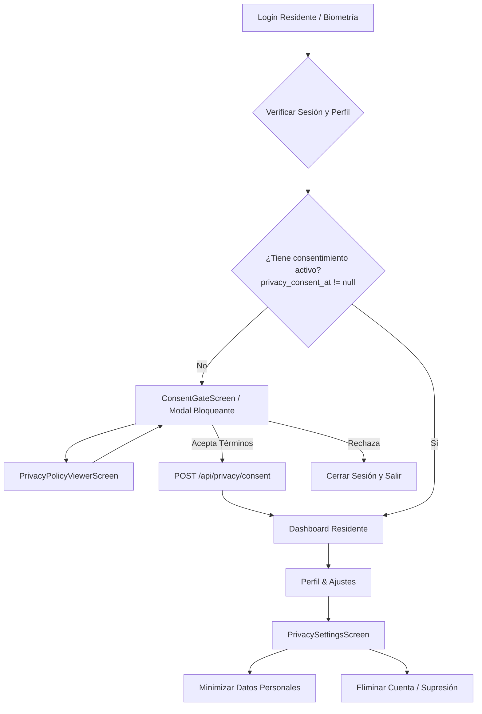

# Product Requirements Document & Plan de Implementación

# Protección de Datos (Ley N° 21.719) en la App Móvil - React Native

> **Proyecto:** Visitme Mobile (iOS & Android)  
> **Versión:** 1.0  
> **Fecha:** 2026-08-19  
> **Estado:** Listo para Desarrollo  
> **Owner:** Visitme Mobile Team  
> **Tecnologías:** React Native, Expo / Bare RN, TypeScript, Supabase Client, OneSignal RN SDK, AsyncStorage

---

## 1. Visión General y Objetivos Móviles

La aplicación móvil de Visitme para residentes debe cumplir con las exigencias de la **Ley N° 21.719 de Protección de Datos Personales de Chile** y la **Ley N° 21.442 de Copropiedad Inmobiliaria**, adaptando la experiencia nativa de iOS y Android para garantizar:

1. **Consent Gate Bloqueante Nativo:** Impedir el acceso a funcionalidades de la app hasta que el residente haya revisado y aceptado los Términos y la Política de Privacidad en su primer login o actualización de términos.
2. **Centro de Privacidad y Derechos ARCO:** Pantalla nativa accesible desde el perfil para consultar datos, minimizar información o solicitar la eliminación total de la cuenta.
3. **Consentimiento Explícito de Datos Sensibles:** Bloque de salud en la ficha del residente que exige autorización destacada (Art. 16) si se declara electrodependencia o movilidad reducida.
4. **Desconexión Limpia de Push & Identidades:** Al darse de baja o minimizar datos, desvincular el ID de dispositivo en OneSignal y purgar tokens en `AsyncStorage`.
5. **Continuidad de Espacios Comunes:** Explicar con claridad que las reservas y cobros pasados/vigentes quedan radicados en el departamento (`department_id`) para los gastos comunes del edificio.

---

## 2. Flujo de Navegación Móvil y Estado de Privacidad



---

## 3. Arquitectura de Estado y Contexto Móvil

### 3.1 Interface de Usuario en React Native

```typescript
// types/user.ts
export interface MobileUserContextType {
  id: string;
  name: string;
  email: string;
  role: "resident" | "concierge" | "admin";
  communityId: string;
  communitySlug: string;
  communityName: string;
  avatarUrl: string | null;
  privacyConsentAt: string | null;
  dataProcessingStatus:
    "pending_consent" | "active" | "minimized" | "revoked" | "anonymized";
  userDepartments: {
    departmentId: string;
    departmentNumber: string;
    communityId: string;
  }[];
  updateUserConsent: (consentedAt: string) => Promise<void>;
  logout: () => Promise<void>;
}
```

### 3.2 Lógica de Inicialización en `AuthProvider.tsx`

```typescript
// providers/AuthProvider.tsx
import React, { createContext, useContext, useEffect, useState } from 'react';
import AsyncStorage from '@react-native-async-storage/async-storage';
import { supabase } from '../lib/supabase';
import OneSignal from 'react-native-onesignal';

const CURRENT_PRIVACY_VERSION = 'v1.0-2026-12';

export const AuthProvider = ({ children }: { children: React.ReactNode }) => {
  const [user, setUser] = useState<any>(null);
  const [loading, setLoading] = useState(true);

  const fetchProfile = async (userId: string) => {
    const { data: profile } = await supabase
      .from('users')
      .select('id, name, email, role, avatar_url, privacy_consent_at, data_processing_status')
      .eq('id', userId)
      .single();

    if (profile) {
      setUser(profile);
      await AsyncStorage.setItem('@visitme_user', JSON.stringify(profile));
    }
  };

  const updateUserConsent = async (consentedAt: string) => {
    setUser((prev: any) => ({
      ...prev,
      privacy_consent_at: consentedAt,
      data_processing_status: 'active',
    }));
  };

  const logout = async () => {
    await OneSignal.logout();
    await supabase.auth.signOut();
    await AsyncStorage.clear();
    setUser(null);
  };

  return (
    <AuthContext.Provider value={{ user, loading, updateUserConsent, logout }}>
      {children}
    </AuthContext.Provider>
  );
};
```

---

## 4. Especificación de Pantallas y Componentes

### 4.1 Pantalla 1: `ConsentGateModal.tsx` (Bloqueo de Onboarding)

- **Propósito:** Mostrar la información obligatoria de la Ley 21.719 en el primer inicio de sesión del residente.
- **Comportamiento:**
  - Modal de pantalla completa no descartable (`backdropPress` deshabilitado, botón físico atrás en Android interceptado).
  - Checkbox interactivo obligatorio para Términos y Política de Privacidad.
  - Checkbox opcional para notificaciones de marketing/novedades.
  - Botón _"Aceptar y Continuar"_ llama al backend y desbloquea el flujo.
  - Botón _"Rechazar y Salir"_ ejecuta `logout()`.

```typescript
// components/privacy/ConsentGateModal.tsx
import React, { useState } from 'react';
import { Modal, View, Text, StyleSheet, TouchableOpacity, ScrollView, ActivityIndicator, Alert } from 'react-native';
import { Shield, Lock, Building, Bell, Calendar, ChevronRight, LogOut, Check } from 'lucide-react-native';

interface Props {
  visible: boolean;
  userName?: string;
  communityName?: string;
  onConsentSuccess: () => void;
  onLogout: () => void;
  onOpenPrivacyPolicy: () => void;
}

export const ConsentGateModal = ({
  visible,
  userName = 'Vecino/a',
  communityName = 'tu comunidad',
  onConsentSuccess,
  onLogout,
  onOpenPrivacyPolicy,
}: Props) => {
  const [acceptedTerms, setAcceptedTerms] = useState(false);
  const [acceptedMarketing, setAcceptedMarketing] = useState(false);
  const [loading, setLoading] = useState(false);

  const handleAccept = async () => {
    if (!acceptedTerms) {
      Alert.alert('Atención', 'Debes aceptar los Términos y la Política de Privacidad para continuar.');
      return;
    }

    setLoading(true);
    try {
      const res = await fetch('https://app.visitme.cl/api/privacy/consent', {
        method: 'POST',
        headers: { 'Content-Type': 'application/json' },
        body: JSON.stringify({
          terms_version: 'v1.0-2026-12',
          privacy_version: 'v1.0-2026-12',
          marketing_accepted: acceptedMarketing,
        }),
      });

      if (!res.ok) throw new Error('Error al guardar el consentimiento');

      onConsentSuccess();
    } catch (err: any) {
      Alert.alert('Error', err.message || 'No fue posible registrar el consentimiento.');
    } finally {
      setLoading(false);
    }
  };

  return (
    <Modal visible={visible} animationType="slide" transparent={false}>
      <View style={styles.container}>
        <View style={styles.header}>
          <Shield size={36} color="#ffffff" />
          <Text style={styles.badgeText}>Ley N° 21.719 • Chile</Text>
          <Text style={styles.headerTitle}>Protección de tus Datos</Text>
        </View>

        <ScrollView style={styles.body} contentContainerStyle={{ paddingBottom: 40 }}>
          <Text style={styles.greeting}>
            Hola <Text style={{ fontWeight: 'bold' }}>{userName}</Text>, la administración de{' '}
            <Text style={{ fontWeight: 'bold', color: '#2563eb' }}>{communityName}</Text> utiliza Visitme para la gestión comunitaria y accesos.
          </Text>

          <View style={styles.purposeCard}>
            <Text style={styles.purposeTitle}>¿Para qué tratamos tus datos?</Text>
            <View style={styles.purposeRow}>
              <Building size={18} color="#2563eb" />
              <Text style={styles.purposeText}>Control de acceso vehicular y peatonal seguro</Text>
            </View>
            <View style={styles.purposeRow}>
              <Bell size={18} color="#7c3aed" />
              <Text style={styles.purposeText}>Avisos de encomiendas y seguridad en tu teléfono</Text>
            </View>
            <View style={styles.purposeRow}>
              <Calendar size={18} color="#059669" />
              <Text style={styles.purposeText}>Gestión y reserva de espacios comunes</Text>
            </View>
          </View>

          <TouchableOpacity style={styles.policyLink} onPress={onOpenPrivacyPolicy}>
            <Text style={styles.policyLinkText}>Leer Política de Privacidad completa</Text>
            <ChevronRight size={16} color="#2563eb" />
          </TouchableOpacity>

          {/* Checkboxes */}
          <TouchableOpacity
            style={styles.checkboxContainer}
            onPress={() => setAcceptedTerms(!acceptedTerms)}
            activeOpacity={0.8}
          >
            <View style={[styles.checkbox, acceptedTerms && styles.checkboxActive]}>
              {acceptedTerms && <Check size={14} color="#fff" />}
            </View>
            <Text style={styles.checkboxLabel}>
              <Text style={{ color: '#dc2626', fontWeight: 'bold' }}>* Obligatorio: </Text>
              Acepto los Términos de Servicio y la Política de Tratamiento de Datos (Ley N° 21.719).
            </Text>
          </TouchableOpacity>

          <TouchableOpacity
            style={styles.checkboxContainer}
            onPress={() => setAcceptedMarketing(!acceptedMarketing)}
            activeOpacity={0.8}
          >
            <View style={[styles.checkbox, acceptedMarketing && styles.checkboxActive]}>
              {acceptedMarketing && <Check size={14} color="#fff" />}
            </View>
            <Text style={styles.checkboxLabel}>
              (Opcional): Acepto recibir novedades y mejoras del servicio Visitme.
            </Text>
          </TouchableOpacity>
        </ScrollView>

        <View style={styles.footer}>
          <TouchableOpacity style={styles.logoutButton} onPress={onLogout}>
            <LogOut size={18} color="#64748b" />
            <Text style={styles.logoutButtonText}>Salir</Text>
          </TouchableOpacity>

          <TouchableOpacity
            style={[styles.submitButton, !acceptedTerms && { opacity: 0.5 }]}
            onPress={handleAccept}
            disabled={!acceptedTerms || loading}
          >
            {loading ? <ActivityIndicator color="#fff" /> : <Text style={styles.submitButtonText}>Aceptar y Continuar</Text>}
          </TouchableOpacity>
        </View>
      </View>
    </Modal>
  );
};

const styles = StyleSheet.create({
  container: { flex: 1, backgroundColor: '#ffffff' },
  header: { backgroundColor: '#2563eb', padding: 24, paddingTop: 48, alignItems: 'center' },
  badgeText: { color: '#bfdbfe', fontSize: 12, marginTop: 8, fontWeight: '600' },
  headerTitle: { color: '#ffffff', fontSize: 20, fontWeight: 'bold', marginTop: 4 },
  body: { flex: 1, padding: 20 },
  greeting: { fontSize: 14, color: '#334155', lineHeight: 20, marginBottom: 16 },
  purposeCard: { backgroundColor: '#f8fafc', borderRadius: 12, padding: 16, marginBottom: 16, borderWidth: 1, borderColor: '#e2e8f0' },
  purposeTitle: { fontSize: 13, fontWeight: 'bold', color: '#1e293b', marginBottom: 12 },
  purposeRow: { flexDirection: 'row', alignItems: 'center', gap: 10, marginBottom: 8 },
  purposeText: { fontSize: 12, color: '#475569', flex: 1 },
  policyLink: { flexDirection: 'row', alignItems: 'center', justifyContent: 'space-between', paddingVertical: 12, borderBottomWidth: 1, borderColor: '#f1f5f9', marginBottom: 16 },
  policyLinkText: { fontSize: 13, color: '#2563eb', fontWeight: '600' },
  checkboxContainer: { flexDirection: 'row', alignItems: 'flex-start', gap: 10, marginBottom: 14 },
  checkbox: { width: 22, height: 22, borderRadius: 6, borderWidth: 2, borderColor: '#94a3b8', alignItems: 'center', justifyContent: 'center' },
  checkboxActive: { backgroundColor: '#2563eb', borderColor: '#2563eb' },
  checkboxLabel: { fontSize: 12, color: '#334155', flex: 1, lineHeight: 18 },
  footer: { flexDirection: 'row', padding: 16, borderTopWidth: 1, borderColor: '#e2e8f0', gap: 12 },
  logoutButton: { flexDirection: 'row', alignItems: 'center', gap: 6, paddingHorizontal: 16, paddingVertical: 12, borderRadius: 8 },
  logoutButtonText: { color: '#64748b', fontWeight: '600', fontSize: 14 },
  submitButton: { flex: 1, backgroundColor: '#2563eb', borderRadius: 8, alignItems: 'center', justifyContent: 'center', paddingVertical: 12 },
  submitButtonText: { color: '#ffffff', fontWeight: 'bold', fontSize: 14 },
});
```

---

### 4.2 Pantalla 2: `PrivacySettingsScreen.tsx` (Centro de Derechos ARCO)

Ubicada en la navegación de Ajustes (`SettingsStack`), permitiendo dos acciones:

1. **Minimización de Datos:** Purgar datos prescindibles manteniendo el acceso.
2. **Supresión / Eliminación de Cuenta:** Modal con confirmación que ejecuta la baja y redirige a la pantalla de Login.

```typescript
// screens/settings/PrivacySettingsScreen.tsx
import React, { useState } from 'react';
import { View, Text, StyleSheet, TouchableOpacity, Alert, ScrollView } from 'react-native';
import { Shield, Trash2, Minimize2, ExternalLink } from 'lucide-react-native';
import { useAuth } from '../../hooks/useAuth';

export const PrivacySettingsScreen = ({ navigation }: any) => {
  const { user, logout } = useAuth();
  const [loading, setLoading] = useState(false);

  const handleMinimize = () => {
    Alert.alert(
      'Minimizar mis datos',
      'Se eliminarán de los servidores tu RUT, ficha médica, vehículos y mascotas registradas. Podrás seguir usando la app para visitas y reservas.',
      [
        { text: 'Cancelar', style: 'cancel' },
        {
          text: 'Confirmar y Purgar',
          style: 'destructive',
          onPress: async () => {
            setLoading(true);
            try {
              const res = await fetch('https://app.visitme.cl/api/privacy/minimize', { method: 'POST' });
              if (res.ok) {
                Alert.alert('Éxito', 'Tus datos accesorios han sido suprimidos.');
              }
            } catch {
              Alert.alert('Error', 'No se pudo completar la minimización.');
            } finally {
              setLoading(false);
            }
          },
        },
      ]
    );
  };

  const handleDeleteAccount = () => {
    Alert.alert(
      'Eliminación de Cuenta',
      '¿Deseas dar de baja tu cuenta definitivamente? Perderás acceso a la app y avisos en el móvil. Las reservas existentes permanecerán asignadas a tu departamento para los gastos comunes.',
      [
        { text: 'Cancelar', style: 'cancel' },
        {
          text: 'Eliminar mi Cuenta',
          style: 'destructive',
          onPress: async () => {
            try {
              await fetch('https://app.visitme.cl/api/privacy/delete-account', {
                method: 'POST',
                headers: { 'Content-Type': 'application/json' },
                body: JSON.stringify({ confirmation_text: 'ELIMINAR' }),
              });
              await logout();
            } catch {
              Alert.alert('Error', 'No se pudo procesar la eliminación.');
            }
          },
        },
      ]
    );
  };

  return (
    <ScrollView style={styles.container}>
      <View style={styles.card}>
        <Shield size={24} color="#2563eb" />
        <Text style={styles.title}>Tus Derechos de Privacidad</Text>
        <Text style={styles.subtitle}>Conforme a la Ley N° 21.719 de Chile</Text>
      </View>

      <View style={styles.section}>
        <TouchableOpacity style={styles.actionRow} onPress={handleMinimize}>
          <Minimize2 size={20} color="#d97706" />
          <View style={{ flex: 1, marginLeft: 12 }}>
            <Text style={styles.actionTitle}>Minimizar datos personales</Text>
            <Text style={styles.actionDesc}>Purga RUT, salud y vehículos conservando tu cuenta.</Text>
          </View>
        </TouchableOpacity>

        <TouchableOpacity style={[styles.actionRow, { borderBottomWidth: 0 }]} onPress={handleDeleteAccount}>
          <Trash2 size={20} color="#dc2626" />
          <View style={{ flex: 1, marginLeft: 12 }}>
            <Text style={[styles.actionTitle, { color: '#dc2626' }]}>Eliminar cuenta de Visitme</Text>
            <Text style={styles.actionDesc}>Baja definitiva y anonimización de tu perfil digital.</Text>
          </View>
        </TouchableOpacity>
      </View>

      <TouchableOpacity
        style={styles.policyRow}
        onPress={() => navigation.navigate('PrivacyPolicyViewer')}
      >
        <Text style={styles.policyText}>Ver Política de Privacidad de Visitme</Text>
        <ExternalLink size={16} color="#2563eb" />
      </TouchableOpacity>
    </ScrollView>
  );
};

const styles = StyleSheet.create({
  container: { flex: 1, backgroundColor: '#f8fafc', padding: 16 },
  card: { backgroundColor: '#ffffff', padding: 20, borderRadius: 12, alignItems: 'center', marginBottom: 16, elevation: 1 },
  title: { fontSize: 16, fontWeight: 'bold', color: '#1e293b', marginTop: 8 },
  subtitle: { fontSize: 12, color: '#64748b', marginTop: 2 },
  section: { backgroundColor: '#ffffff', borderRadius: 12, paddingHorizontal: 16, marginBottom: 16, elevation: 1 },
  actionRow: { flexDirection: 'row', alignItems: 'center', paddingVertical: 16, borderBottomWidth: 1, borderColor: '#f1f5f9' },
  actionTitle: { fontSize: 14, fontWeight: '600', color: '#1e293b' },
  actionDesc: { fontSize: 12, color: '#64748b', marginTop: 2 },
  policyRow: { flexDirection: 'row', alignItems: 'center', justifyContent: 'center', gap: 6, padding: 12 },
  policyText: { fontSize: 13, color: '#2563eb', fontWeight: '600' },
});
```

---

### 4.3 Pantalla 3: Consentimiento de Salud en `ResidentProfileScreen.tsx`

Al editar la Ficha de Residente en React Native, si se marcan los campos `is_electro_dependent`, `has_reduced_mobility` o `additional_notes`, se debe renderizar el bloque de consentimiento explícito (Art. 16):

```typescript
// Fragmento para el formulario de Ficha de Residente en React Native
{ (isElectroDependent || hasReducedMobility || additionalNotes.trim().length > 0) && (
  <View style={styles.healthConsentBox}>
    <TouchableOpacity
      style={styles.consentRow}
      onPress={() => setHealthConsent(!healthConsent)}
    >
      <View style={[styles.miniCheck, healthConsent && styles.miniCheckActive]}>
        {healthConsent && <Check size={12} color="#fff" />}
      </View>
      <Text style={styles.healthConsentText}>
        <Text style={{ fontWeight: 'bold' }}>Consentimiento Explícito (Art. 16 Ley 21.719):</Text>{' '}
        Autorizo el uso de estos datos de salud para auxilio y priorización exclusiva en emergencias por conserjería y bomberos.
      </Text>
    </TouchableOpacity>
  </View>
)}
```

---

## 5. Manejo de OneSignal y Notificaciones Push en React Native

Cuando un residente decide **Minimizar** o **Eliminar** su cuenta:

1. **Desvinculación:**
   ```typescript
   import OneSignal from "react-native-onesignal";

   // Al hacer logout o eliminar cuenta:
   await OneSignal.logout();
   await OneSignal.User.removeTags(["user_email", "community_id"]);
   ```
2. **Eliminación en Supabase:**
   El endpoint `/api/privacy/delete-account` elimina automáticamente los registros de `onesignal_players` vinculados al `user_id`.

---

## 6. Checklist de Implementación en React Native

| Tarea                                  | Archivo / Componente RN                         | Estado    |
| :------------------------------------- | :---------------------------------------------- | :-------- |
| **1. Estado de Privacidad en Auth**    | `providers/AuthProvider.tsx`                    | Pendiente |
| **2. Modal Consent Gate Bloqueante**   | `components/privacy/ConsentGateModal.tsx`       | Pendiente |
| **3. Visor de Política de Privacidad** | `screens/privacy/PrivacyPolicyViewerScreen.tsx` | Pendiente |
| **4. Centro de Derechos ARCO**         | `screens/settings/PrivacySettingsScreen.tsx`    | Pendiente |
| **5. Consentimiento Salud en Ficha**   | `screens/profile/ResidentProfileScreen.tsx`     | Pendiente |
| **6. Navegación en RootNavigator**     | `navigation/RootNavigator.tsx`                  | Pendiente |

---

## 7. Conclusión

Este plan traslada con total fidelidad la arquitectura de la Ley 21.719 y la lógica desarrollada en el backend web hacia la **App Móvil de React Native**, garantizando que los residentes en iOS y Android disfruten de una experiencia nativa fluida y jurídicamente blindada antes de diciembre.
