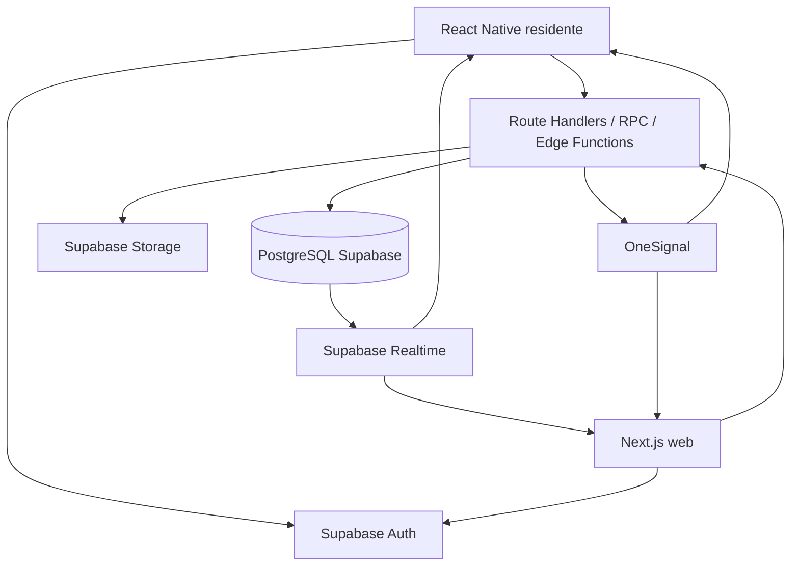

# Documento técnico de arquitectura: Chat entre residentes y conserjería

**Documento complementario de:** [`PLAN-CHAT-RESIDENTES-CONSERJERIA.md`](./PLAN-CHAT-RESIDENTES-CONSERJERIA.md)

**Estado:** Propuesta técnica para implementación

---

## 1. Propósito

Este documento define la arquitectura técnica del sistema de conversaciones entre residentes y conserjería para Visitme.

El sistema estará integrado con:

- La aplicación React Native existente para residentes.
- La aplicación Next.js existente para conserjes y administradores.
- Supabase como plataforma de autenticación, base de datos, Realtime, Storage y RLS.
- OneSignal como proveedor de notificaciones push existente.

La arquitectura debe soportar:

- Una o varias cuentas de conserjería por comunidad.
- Bandeja compartida.
- Notificación a todos los conserjes autorizados.
- Asignación de una conversación a un usuario.
- Cambio de responsable entre turnos.
- Historial persistente.
- Auditoría funcional.
- Conversaciones resueltas, cerradas y reabiertas.
- Bajo volumen inicial y crecimiento posterior sin rediseño estructural.

---

## 2. Principios de diseño

### 2.1. La conversación pertenece al caso

La conversación no pertenece permanentemente a un conserje. El conserje es el responsable actual y puede cambiar por cambio de turno, ausencia o reasignación administrativa.

```text
Conversación
  ├── residente
  ├── comunidad
  ├── departamento
  ├── responsable actual
  ├── mensajes
  ├── archivos
  └── historial de eventos
```

### 2.2. El turno no pertenece al sistema

El sistema no gestionará horarios ni turnos laborales en la primera versión. La comunidad decide qué usuarios crea y quién está operativo.

La plataforma sólo debe registrar:

- Quién era el responsable.
- Quién tomó la conversación.
- Quién respondió.
- Quién reasignó o cerró.

### 2.3. Persistencia antes que tiempo real

Realtime sirve para entregar cambios rápidamente, pero la base de datos es la fuente de verdad.

Un mensaje debe guardarse primero y luego notificarse mediante Realtime. El push tampoco representa persistencia ni entrega garantizada.

### 2.4. Seguridad por relación, no por datos del cliente

La aplicación cliente no puede decidir libremente:

- `sender_id`.
- `community_id`.
- `department_id`.
- `assigned_to`.
- Permisos de lectura.

Estos valores deben derivarse de la sesión autenticada y de las relaciones almacenadas en Supabase.

### 2.5. Auditoría inmutable

Los mensajes y eventos no deben modificarse silenciosamente. Las correcciones, eliminaciones lógicas, reasignaciones y cambios administrativos deben generar eventos.

### 2.6. Simplicidad operacional

Para el volumen inicial no se incorporarán servidores WebSocket propios, colas, Redis, proveedores externos de chat ni servicios de búsqueda externos.

---

## 3. Vista general de componentes



## 3.1. React Native

Responsabilidades:

- Mostrar conversaciones del residente.
- Crear conversaciones.
- Enviar mensajes.
- Subir archivos.
- Suscribirse a mensajes y cambios de estado.
- Marcar mensajes como leídos.
- Procesar notificaciones y deep links.
- Manejar estados de envío y errores de conectividad.

No debe contener claves privilegiadas ni lógica de autorización que sustituya a RLS.

## 3.2. Next.js

Responsabilidades:

- Bandeja de conserjería.
- Detalle de conversaciones.
- Gestión de asignación y estados.
- Administración de usuarios de conserjería.
- Auditoría y supervisión.
- APIs server-side para operaciones sensibles.
- Integración con OneSignal usando secretos sólo del servidor.

## 3.3. Supabase

Responsabilidades:

- Identidad y sesión.
- Persistencia transaccional.
- Autorización mediante RLS.
- Entrega de eventos Realtime.
- Almacenamiento de adjuntos.
- Funciones SQL/RPC para operaciones atómicas.

## 3.4. OneSignal

Responsabilidades:

- Notificación a dispositivos de residentes.
- Notificación a todos los conserjes activos de una comunidad.
- Deep links.
- Gestión de suscripciones push.

OneSignal no será la fuente de verdad del chat.

---

## 4. Actores y autorización

### 4.1. Residente

Alcance:

```text
Sólo conversaciones creadas por el usuario autenticado
```

El sistema debe derivar el departamento y comunidad mediante la relación actual del usuario.

### 4.2. Conserje

Alcance:

```text
Conversaciones de comunidades asociadas al usuario con role = concierge y active = true
```

El modelo permite tanto una cuenta genérica como varias cuentas individuales. Para el sistema todas son usuarios de conserjería.

### 4.3. Administrador de comunidad

Alcance:

```text
Todas las conversaciones de las comunidades administradas
```

Puede ver auditoría, administrar usuarios autorizados, reasignar y reabrir conversaciones.

### 4.4. Service role

La clave `SUPABASE_SERVICE_ROLE_KEY` sólo se utilizará en:

- Route Handlers server-side.
- Jobs controlados.
- Funciones backend seguras.
- Procesos de notificación.

Nunca se expondrá a React Native, navegador o variables `NEXT_PUBLIC_*`.

---

## 5. Modelo de datos técnico

La implementación debe reutilizar las relaciones existentes de usuarios, comunidades y departamentos. Los nombres exactos de tablas y columnas deben confirmarse antes de crear las migraciones.

## 5.1. `chat_conversations`

```sql
id uuid primary key default gen_random_uuid(),
community_id uuid not null,
department_id uuid not null,
created_by uuid not null,
assigned_to uuid null,
category text null,
priority text not null default 'normal',
status text not null default 'open',
subject text null,
last_message_at timestamptz not null default now(),
first_response_at timestamptz null,
resolved_at timestamptz null,
resolved_by uuid null,
closed_at timestamptz null,
closed_by uuid null,
reopened_at timestamptz null,
reopened_by uuid null,
created_at timestamptz not null default now(),
updated_at timestamptz not null default now()
```

Restricciones sugeridas:

```text
status in ('open', 'assigned', 'pending_resident', 'pending_internal', 'resolved', 'closed')
priority in ('low', 'normal', 'high', 'urgent')
```

La existencia de `community_id` y `department_id` debe validarse con claves foráneas cuando sea compatible con el esquema actual.

## 5.2. `chat_messages`

```sql
id uuid primary key default gen_random_uuid(),
conversation_id uuid not null,
sender_id uuid not null,
message_type text not null default 'text',
body text null,
client_message_id text null,
metadata jsonb not null default '{}'::jsonb,
created_at timestamptz not null default now(),
edited_at timestamptz null,
deleted_at timestamptz null,
deleted_by uuid null
```

Restricciones sugeridas:

```text
message_type in ('text', 'system', 'internal_note')
```

`body` puede ser nullable para mensajes que sólo contienen archivos, aunque la interfaz inicial puede exigir texto o archivo.

## 5.3. `chat_message_attachments`

```sql
id uuid primary key default gen_random_uuid(),
message_id uuid not null,
storage_path text not null,
file_name text not null,
mime_type text not null,
file_size bigint not null,
checksum text null,
created_at timestamptz not null default now(),
deleted_at timestamptz null
```

## 5.4. `chat_message_reads`

```sql
message_id uuid not null,
user_id uuid not null,
read_at timestamptz not null default now(),
primary key (message_id, user_id)
```

Si el volumen aumenta, puede reemplazarse por un cursor de lectura:

```text
conversation_id
user_id
last_read_message_id
last_read_at
```

## 5.5. `chat_events`

```sql
id uuid primary key default gen_random_uuid(),
conversation_id uuid not null,
actor_id uuid null,
event_type text not null,
from_user_id uuid null,
to_user_id uuid null,
metadata jsonb not null default '{}'::jsonb,
created_at timestamptz not null default now()
```

`chat_events` es el historial de acciones, no reemplaza a `chat_messages`.

## 5.6. Asociación de personal

Antes de crear una tabla nueva, se debe revisar si las tablas existentes ya representan comunidad, usuario y rol.

Si es necesario crear una relación específica:

```sql
community_staff (
  community_id uuid not null,
  user_id uuid not null,
  role text not null,
  active boolean not null default true,
  created_by uuid null,
  created_at timestamptz not null default now(),
  deactivated_at timestamptz null,
  primary key (community_id, user_id)
)
```

No se debe agregar un concepto de `shift` en esta fase.

---

## 6. Índices y rendimiento

Índices mínimos:

```sql
create index idx_chat_conversations_inbox
  on chat_conversations (community_id, status, last_message_at desc);

create index idx_chat_conversations_assigned
  on chat_conversations (assigned_to, status, last_message_at desc);

create index idx_chat_conversations_department
  on chat_conversations (department_id, created_at desc);

create index idx_chat_messages_conversation
  on chat_messages (conversation_id, created_at desc);

create index idx_chat_events_conversation
  on chat_events (conversation_id, created_at desc);
```

Reglas de consulta:

- La bandeja debe paginar.
- El detalle debe cargar mensajes por páginas.
- No se debe descargar todo el historial en cada apertura.
- Los mensajes se deben ordenar por `created_at` e `id` para evitar ambigüedad.
- Los archivos se cargan bajo demanda.

---

## 7. Transacciones y operaciones críticas

## 7.1. Crear conversación

La creación debe garantizar que conversación, primer mensaje y evento se guarden de forma consistente.

Preferencia de implementación:

- Función RPC transaccional en PostgreSQL, o
- Route Handler server-side que ejecute las operaciones con control de errores.

Pasos:

```text
validar sesión
obtener usuario, departamento y comunidad
validar categoría y prioridad
crear conversación
crear primer mensaje
crear chat_event
actualizar last_message_at
solicitar notificaciones
```

El envío de push no debe hacer que una conversación válida se pierda si OneSignal está temporalmente caído. El mensaje debe persistir aunque la notificación falle.

## 7.2. Tomar conversación

La operación debe ser atómica:

```sql
update chat_conversations
set assigned_to = :actor_id,
    status = 'assigned',
    updated_at = now()
where id = :conversation_id
  and assigned_to is null
  and status in ('open', 'pending_internal');
```

Después se debe verificar el número de filas afectadas:

- `1`: asignación exitosa.
- `0`: ya fue tomada, no existe o el usuario no tiene permiso.

La operación completa debe generar:

- Actualización de la conversación.
- Evento `conversation_assigned`.
- Mensaje `system` para el residente, si corresponde.

Estos pasos deberían ejecutarse en una única función transaccional para evitar estados parciales.

## 7.3. Reasignar

La reasignación administrativa o de turno debe guardar:

```text
from_user_id
To_user_id
actor_id
motivo opcional
```

Debe conservar el responsable anterior en `chat_events`, aunque `assigned_to` se actualice.

## 7.4. Enviar mensaje

Debe validarse:

- Sesión activa.
- Acceso a la conversación.
- Tipo de mensaje permitido.
- Longitud máxima.
- `client_message_id` idempotente.
- Estado de conversación compatible.

Para evitar duplicados:

```text
unique(conversation_id, sender_id, client_message_id)
```

La restricción puede implementarse si `client_message_id` siempre se genera para mensajes de cliente.

## 7.5. Cambiar estado

Los cambios de estado deben validar transiciones permitidas. Ejemplos:

```text
open -> assigned
assigned -> pending_resident
assigned -> pending_internal
assigned -> resolved
pending_resident -> assigned
pending_internal -> assigned
resolved -> closed
resolved -> assigned
closed -> open
```

Cada transición debe generar `status_changed` y, para resolución/cierre/reapertura, los campos de fecha y actor correspondientes.

---

## 8. API y contratos lógicos

Los nombres finales de rutas deben adaptarse a las convenciones actuales de `app/api`.

## 8.1. Crear conversación

```http
POST /api/chat/conversations
```

Request:

```json
{
  "category": "consulta_general",
  "priority": "normal",
  "subject": "Consulta",
  "body": "Mensaje inicial"
}
```

El backend no acepta `community_id`, `department_id` ni `created_by` desde el cliente.

Response:

```json
{
  "conversation": {
    "id": "uuid",
    "status": "open",
    "assigned_to": null,
    "community_id": "uuid",
    "department_id": "uuid"
  },
  "message": {
    "id": "uuid",
    "created_at": "timestamp"
  }
}
```

## 8.2. Listar conversaciones del residente

```http
GET /api/chat/conversations?status=open&cursor=...
```

## 8.3. Listar bandeja de conserjería

```http
GET /api/chat/inbox?status=open&assigned=unassigned&cursor=...
```

El backend filtra por las comunidades autorizadas del usuario.

## 8.4. Obtener conversación

```http
GET /api/chat/conversations/{conversation_id}
```

Debe retornar datos mínimos de residente y departamento únicamente si el actor tiene permiso.

## 8.5. Obtener mensajes

```http
GET /api/chat/conversations/{conversation_id}/messages?before=...&limit=50
```

## 8.6. Enviar mensaje

```http
POST /api/chat/conversations/{conversation_id}/messages
```

Request:

```json
{
  "body": "Respuesta del conserje",
  "client_message_id": "uuid-del-cliente",
  "message_type": "text"
}
```

`sender_id` se obtiene de la sesión.

## 8.7. Tomar conversación

```http
POST /api/chat/conversations/{conversation_id}/claim
```

Response de conflicto:

```http
409 Conflict
```

Cuando otro usuario ya tomó la conversación.

## 8.8. Reasignar

```http
POST /api/chat/conversations/{conversation_id}/assign
```

Request:

```json
{
  "assigned_to": "uuid",
  "reason": "Cambio de turno"
}
```

Sólo conserjes autorizados o administradores pueden utilizar esta operación, según política.

## 8.9. Cambiar estado

```http
POST /api/chat/conversations/{conversation_id}/status
```

Request:

```json
{
  "status": "resolved"
}
```

## 8.10. Nota interna

```http
POST /api/chat/conversations/{conversation_id}/internal-notes
```

Esta ruta no debe estar disponible para residentes.

## 8.11. Adjuntos

Se recomienda utilizar una estrategia de upload controlado:

1. Backend valida acceso y tipo/tamaño.
2. Backend genera ruta o URL firmada.
3. Cliente sube a Storage.
4. Backend confirma el archivo.
5. Se crea `chat_message_attachments`.
6. Se registra `attachment_uploaded`.

---

## 9. Realtime

## 9.1. Eventos persistidos

Se utilizarán cambios de PostgreSQL o eventos asociados para notificar:

- Nueva conversación.
- Nuevo mensaje.
- Cambio de estado.
- Cambio de responsable.
- Reapertura.
- Cierre.

## 9.2. Canales lógicos

```text
conversation:{conversation_id}
community:{community_id}:chat-inbox
```

La autorización del canal debe corresponder a RLS y a las reglas de comunidad.

### Canal de conversación

- Residente: sólo si es participante autorizado.
- Conserje: si pertenece a la comunidad.
- Administrador: si administra la comunidad.

### Canal de bandeja

- Conserjes activos de la comunidad.
- Administradores de la comunidad.

## 9.3. Reconexión

Los clientes deben asumir que pueden perder eventos Realtime.

Al reconectar:

1. Revalidar sesión.
2. Volver a suscribirse.
3. Consultar mensajes posteriores al último mensaje conocido.
4. Actualizar la bandeja.
5. Reconciliar mensajes pendientes locales.

Realtime acelera la actualización; la consulta de sincronización evita depender de la entrega perfecta de eventos.

---

## 10. Notificaciones OneSignal

La integración actual debe encapsularse en un servicio de notificaciones de chat, separado de la lógica de negocio.

## 10.1. Destinatarios

### Nueva conversación

```text
usuarios activos
+ rol concierge
+ comunidad de la conversación
```

### Respuesta del conserje

```text
residente creador
```

### Respuesta del residente

```text
responsable actual
```

Si no existe responsable actual:

```text
todos los conserjes activos de la comunidad
```

### Escalamiento

```text
responsable actual
+ conserjes de la comunidad o administrador, según regla de SLA
```

## 10.2. Idempotencia de notificaciones

La notificación puede reintentarse, por lo que se recomienda incluir un identificador lógico:

```text
chat:{conversation_id}:message:{message_id}
```

Esto permite controlar duplicados en el servicio de notificaciones si posteriormente se necesita un registro de entregas.

## 10.3. Privacidad

No incluir en push:

- Contenido completo del mensaje.
- Información médica.
- Reclamos sensibles.
- Documentos.
- Datos innecesarios del departamento.

Contenido recomendado:

```text
Nueva conversación en Visitme
Tienes una conversación pendiente de atención
```

---

## 11. Storage y seguridad de archivos

Bucket recomendado:

```text
chat-attachments
```

La ruta debe evitar exponer datos de forma directa y puede seguir una estructura como:

```text
{community_id}/{conversation_id}/{message_id}/{random_file_name}
```

Reglas:

- Bucket privado.
- URLs firmadas con expiración.
- Validación de MIME y tamaño.
- Nombres de archivo sanitizados.
- No confiar en la extensión.
- No permitir ejecución de contenido.
- Eliminar o revocar acceso mediante `deleted_at`.
- Registrar descarga si el archivo es sensible.

La aplicación no debe exponer rutas Storage públicas permanentes.

---

## 12. RLS: estrategia de implementación

Las políticas deben apoyarse en funciones auxiliares o vistas seguras para no duplicar lógica compleja en cada tabla.

Funciones lógicas sugeridas:

```text
current_user_id()
is_community_admin(community_id)
is_active_concierge(community_id)
is_conversation_resident(conversation_id)
can_view_conversation(conversation_id)
can_write_conversation(conversation_id)
```

## 12.1. Lectura de conversaciones

```text
residente: created_by = auth.uid()
conserje: active concierge asociado a conversation.community_id
admin: administrador de conversation.community_id
```

## 12.2. Lectura de mensajes

La política de mensajes debe delegar el acceso a la conversación relacionada.

```text
can_view_conversation(chat_messages.conversation_id)
```

## 12.3. Notas internas

La política debe impedir que residentes lean mensajes con:

```text
message_type = 'internal_note'
```

## 12.4. Eventos

Los eventos pueden ser visibles:

- Para residentes: sólo eventos de sistema necesarios para continuidad.
- Para conserjes: eventos operativos de su comunidad.
- Para administradores: auditoría completa de sus comunidades.

Si se utiliza una misma tabla, la consulta o vista debe filtrar correctamente la información sensible.

---

## 13. React Native: arquitectura de cliente

El módulo móvil debe integrarse con los patrones existentes de la aplicación.

## 13.1. Capas

```text
Pantallas
   |
Hooks / estado local
   |
Chat API client
   |
Supabase SDK / Route Handlers
   |
Realtime / OneSignal
```

## 13.2. Estado local mínimo

Cada mensaje debe tener un estado de cliente:

```text
pending
sending
sent
failed
```

El objeto local debe contener `client_message_id` para reintento e idempotencia.

## 13.3. Cache

Guardar localmente:

- Lista reciente de conversaciones.
- Últimos mensajes visualizados.
- Mensajes pendientes de envío.

No guardar en almacenamiento inseguro información que no sea necesaria.

## 13.4. Deep links

El deep link debe:

1. Recibir `conversation_id`.
2. Validar la sesión.
3. Consultar autorización en backend.
4. Abrir el detalle.
5. Marcar mensajes como leídos si corresponde.

---

## 14. Next.js: arquitectura web

## 14.1. Capas recomendadas

```text
UI de bandeja
   |
Hooks de chat / suscripciones
   |
API client
   |
Route Handlers server-side
   |
Supabase server client / RPC
```

## 14.2. Bandeja

La bandeja no debe consultar toda la base de datos periódicamente. Debe:

- Obtener una página inicial.
- Suscribirse al canal de comunidad.
- Actualizar o invalidar consultas al recibir eventos.
- Recargar datos cuando se reconecta.

## 14.3. Acciones con conflicto

La interfaz debe manejar:

- `409 Conflict` al tomar una conversación ya asignada.
- `403 Forbidden` por pérdida de permisos.
- `404 Not Found` para conversaciones no visibles.
- `422 Unprocessable Entity` para transiciones inválidas.
- `429 Too Many Requests` si se incorporan límites de envío.

---

## 15. Auditoría y observabilidad

## 15.1. Auditoría funcional

`chat_events` debe registrar quién ejecutó cada acción y sobre qué conversación.

Los eventos deberían incluir en `metadata` información no sensible como:

```json
{
  "previous_status": "open",
  "new_status": "assigned",
  "source": "web"
}
```

No registrar tokens, contraseñas ni contenido completo duplicado de mensajes dentro de metadata.

## 15.2. Logs técnicos

Los logs de servidor deben permitir diagnosticar:

- Error al insertar mensaje.
- Error al enviar push.
- Error de Storage.
- Error de suscripción.
- Error de autorización.
- Fallos de sincronización.

No se debe escribir el contenido completo de mensajes sensibles en logs técnicos.

## 15.3. Métricas iniciales

- Conversaciones creadas.
- Conversaciones abiertas.
- Conversaciones resueltas.
- Conversaciones cerradas.
- Tiempo hasta primera respuesta.
- Tiempo hasta resolución.
- Conversaciones reasignadas.
- Mensajes enviados.
- Errores de notificación.
- Archivos almacenados.

---

## 16. Retención y ciclo de vida

La política exacta debe ser definida por el administrador y la operación de Visitme. Técnicamente se recomienda:

- No borrar mensajes al cerrar una conversación.
- Utilizar `deleted_at` para eliminación lógica.
- Mantener eventos de auditoría.
- Definir retención para archivos pesados.
- Permitir archivado futuro.
- Separar conversación cerrada de conversación eliminada.

Cualquier proceso automático de retención debe:

1. Identificar registros elegibles.
2. Registrar el evento.
3. Aplicar borrado lógico o eliminación según política.
4. Mantener referencias mínimas de auditoría.

---

## 17. Validación y límites

Límites iniciales recomendados:

```text
Mensaje de texto: 4.000 caracteres
Imagen: 5 MB
PDF: 10 MB
Archivos por mensaje: 5
```

Los límites deben ser iguales o compatibles en:

- React Native.
- Next.js.
- Route Handlers.
- Storage.
- RLS o funciones de validación.

El cliente puede validar para mejorar UX, pero el backend debe validar nuevamente.

---

## 18. Pruebas técnicas

## 18.1. Base de datos

- Constraints de estados.
- Claves foráneas.
- Índices.
- Idempotencia con `client_message_id`.
- Asignación concurrente.
- Transiciones de estado.
- Triggers de timestamps.

## 18.2. Seguridad

- Residente accediendo a otra conversación.
- Residente accediendo a otro departamento.
- Conserje accediendo a otra comunidad.
- Administrador accediendo a comunidad no administrada.
- Acceso a notas internas desde móvil.
- URL de Storage sin autorización.
- Usuario desactivado intentando responder.

## 18.3. Realtime

- Nuevo mensaje en web.
- Nuevo mensaje en móvil.
- Reconexión.
- Pérdida temporal de eventos.
- Cambio de responsable.
- Nuevo ticket en bandeja.

## 18.4. Notificaciones

- Nueva conversación notifica a todos los conserjes.
- Respuesta notifica al residente.
- Nuevo mensaje notifica al responsable actual.
- No se notifica a otra comunidad.
- Deep link correcto.
- Token inválido se limpia.

## 18.5. Flujo de turnos

- Conversación asignada a turno de tarde.
- Turno de noche ve el historial.
- Turno de noche toma la conversación.
- Se registra la reasignación.
- El residente recibe el evento.
- El administrador ve ambas etapas.

---

## 19. Despliegue y configuración

## 19.1. Variables web/server

Nombres a confirmar con la configuración existente:

```text
NEXT_PUBLIC_SUPABASE_URL
NEXT_PUBLIC_SUPABASE_ANON_KEY
SUPABASE_SERVICE_ROLE_KEY
NEXT_PUBLIC_ONESIGNAL_APP_ID
ONESIGNAL_API_KEY
```

Sólo las variables `NEXT_PUBLIC_*` pueden llegar al cliente. La API key de OneSignal y la service role key deben permanecer server-side.

## 19.2. Migraciones

Las migraciones deben:

- Ser incrementales.
- No eliminar tablas existentes.
- No ejecutar `DROP TABLE` sobre auditoría sin una migración explícita y revisada.
- Crear índices y políticas junto con las tablas.
- Incluir rollback documentado cuando sea posible.

## 19.3. Orden de despliegue

1. Crear migraciones y funciones.
2. Aplicar RLS y verificar consultas.
3. Desplegar backend compatible.
4. Desplegar web.
5. Publicar actualización móvil.
6. Activar feature flag o acceso por comunidad.
7. Ejecutar piloto.

La aplicación móvil debe tolerar que el backend todavía no tenga el módulo activado. La activación puede realizarse por comunidad.

---

## 20. Feature flags y piloto

Se recomienda activar el chat inicialmente sólo para la comunidad piloto.

Opciones:

```text
community_chat_enabled
```

Puede estar en una configuración de comunidad o en una tabla de funcionalidades.

La activación gradual permite:

- Probar permisos.
- Validar push.
- Medir Realtime.
- Obtener feedback de conserjes.
- Evitar exponer el módulo a todas las comunidades antes de tiempo.

---

## 21. Decisiones técnicas pendientes

Antes de implementar las migraciones se deben confirmar:

1. Nombres reales de tablas de usuarios, comunidades y departamentos.
2. Relación actual entre residente y departamento.
3. Relación actual entre conserje y comunidad.
4. Nombres oficiales de roles.
5. Estrategia existente para OneSignal players.
6. Estrategia de upload móvil ya utilizada.
7. Política de mensajes entre residentes del mismo departamento.
8. Permisos de conserjes para ver conversaciones asignadas a otros.
9. Duración de `resolved` antes de `closed`.
10. Tiempo permitido para reabrir.
11. Categorías y prioridades definitivas.
12. Límite y tipos de archivos.
13. Mensajes visibles al residente durante cambios de responsable.
14. Política de retención.
15. Necesidad de Sentry.

---

## 22. Riesgos técnicos y mitigaciones

### Riesgo: pérdida de eventos Realtime

**Mitigación:** persistencia en PostgreSQL y sincronización al reconectar.

### Riesgo: mensajes duplicados por reintento móvil

**Mitigación:** `client_message_id` único por conversación y remitente.

### Riesgo: dos conserjes toman el mismo caso

**Mitigación:** actualización atómica con condición `assigned_to IS NULL`.

### Riesgo: push no entregado

**Mitigación:** bandeja persistente, logs de envío y reintentos controlados.

### Riesgo: acceso cruzado entre comunidades

**Mitigación:** RLS basada en relaciones de usuario y comunidad, más pruebas negativas.

### Riesgo: exposición de archivos

**Mitigación:** bucket privado y URLs firmadas.

### Riesgo: historiales muy grandes

**Mitigación:** paginación, índices y política de archivado.

### Riesgo: uso indebido del canal para emergencias

**Mitigación:** aviso visible, categoría urgente y canales oficiales de emergencia.

### Riesgo: cuenta compartida sin trazabilidad personal

**Mitigación:** el sistema registra correctamente el usuario autenticado, sin afirmar una identidad física que no puede conocer. La comunidad decide si utiliza una o varias cuentas.

---

## 23. Criterios técnicos de finalización

La arquitectura se considera implementada cuando:

- Las tablas tienen migraciones reproducibles.
- RLS cubre residente, conserje y administrador.
- Una conversación se crea con comunidad y departamento derivados server-side.
- El primer mensaje y el evento de creación son consistentes.
- Todos los conserjes activos reciben la notificación de una nueva conversación.
- La bandeja se actualiza en tiempo real.
- La asignación es atómica.
- Los cambios de turno conservan historial y eventos.
- El nuevo conserje puede continuar una conversación previa.
- El residente puede ver eventos de continuidad.
- Las notas internas no se exponen al residente.
- Los estados tienen transiciones validadas.
- Se puede cerrar y reabrir sin perder datos.
- Los archivos se almacenan de forma privada.
- Los mensajes móviles son idempotentes.
- La reconexión recupera eventos faltantes.
- El administrador puede reconstruir quién atendió cada etapa.
- Existen pruebas automatizadas para permisos y concurrencia.

---

## 24. Resultado arquitectónico

La solución final será una bandeja comunitaria persistente, con asignación flexible y continuidad entre turnos:

```text
Residente
   |
   v
Crea conversación
   |
   v
PostgreSQL guarda conversación + mensaje + evento
   |
   +--> Realtime actualiza bandeja
   +--> OneSignal notifica conserjes
   |
   v
Conserje toma la conversación
   |
   v
Se registra responsable actual
   |
   v
Responde durante su turno
   |
   v
El siguiente turno lee historial y retoma
   |
   v
Administrador supervisa mensajes y auditoría
   |
   v
Conversación se resuelve, cierra o reabre
```

La arquitectura mantiene la implementación inicial simple y compatible con la capa gratuita actual, pero deja preparados los puntos necesarios para crecer en número de comunidades, conserjes, conversaciones, archivos y reglas de supervisión.

---

## 25. Estado actual de la arquitectura

La arquitectura está parcialmente implementada en la aplicación Next.js y Supabase.

### Componentes existentes

- React Native existente para residentes.
- OneSignal existente en React Native.
- Route Handlers de chat en Next.js.
- PostgreSQL y RLS para el chat.
- Supabase Realtime para web.
- Bandeja completa de conserjería.
- Widget flotante dentro de `ConciergeLayout`.
- Funciones SQL para asignación, retoma, reasignación y estados.

### Decisiones confirmadas

- El administrador puede crear uno o varios usuarios `concierge`.
- Todos los conserjes activos de la comunidad reciben nuevas conversaciones.
- Una conversación puede ser retomada por el siguiente turno.
- El sistema no administra turnos laborales.
- El administrador puede supervisar conversaciones y auditoría.
- El nombre visible de la comunidad debe venir de `communityName`; el slug se usa sólo para rutas.

### Pendientes de arquitectura

- Integrar el módulo en la app React Native existente.
- Completar Storage y adjuntos.
- Añadir paginación por cursor y recuperación tras reconexión.
- Crear pruebas automatizadas de RLS y concurrencia.
- Resolver la discrepancia histórica de migraciones antes del despliegue remoto.
